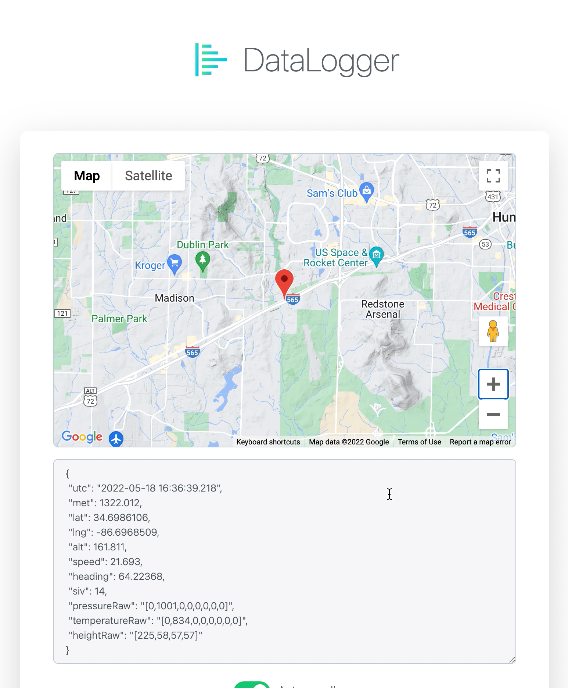

 

<b>WebSerial</b> is a Serial Monitor for <b>ESP8266</b> & <b>ESP32</b> Microcontrollers that can be accessed remotely via a web browser. Webpage is stored in program memory of the microcontroller.

 

<h2 align="center">Preview</h2>

 
 
 

<h2>Features</h2>

  <ul style="list-style-position: inside;">
      <li>Works on Websockets</li>
      <li>Realtime logging</li>
      <li>Any number of Serial Monitors can be opened on the browser</li>
      <li>Uses Async Webserver for better performance</li>
  </ul>

 
 

<h2>Dependencies</h2>

  <h5>For ESP8266:</h5>
  <ul>
      <li>ESP8266 Arduino Core - <b>(latest)</b></li>
      <li>ESPAsyncTCP - <b>v1.2.2</b></li>
  	  <li>ESPAsyncWebServer - <b>v1.2.3</b></li>
  </ul>
  
  <h5>For ESP32:</h5>
  <ul>
      <li>ESP32 Arduino Core - <b>(latest)</b></li>
      <li>AsyncTCP - <b>v1.1.1</b></li>
  	  <li>ESPAsyncWebServer - <b>v1.2.3</b></li>
  </ul>

 

<h2>Documentation</h2>

WebSerial is very similar to the default Serial Monitor Library of Arduino.

Please see `Demo` examples for better understanding on how to setup WebSerial for your Project: [Click Here](https://github.com/foomoon/WebSerial/blob/master/examples/ESP8266_Demo/ESP8266_Demo.ino)

WebSerial has 2 main functions:
- `print`
- `println`

`print` - simply prints the data sent over WebSerial without any newline character.

`println` - prints the data sent over WebSerial with a newline character.

Both functions support the following datatypes: `String`, `const char`, `char`, `int`, `uint8_t`, `uint16_t`, `uint32_t`, `double`, `float`.

<b>To Access Webserial:</b> Go to `<IP Address>/webserial` in your browser ( where `<IP Address>` is the IP of your ESP).

 

<h2>License</h2>
WebSerial is licensed under General Public License v3 ( GPLv3 ).
 
 

